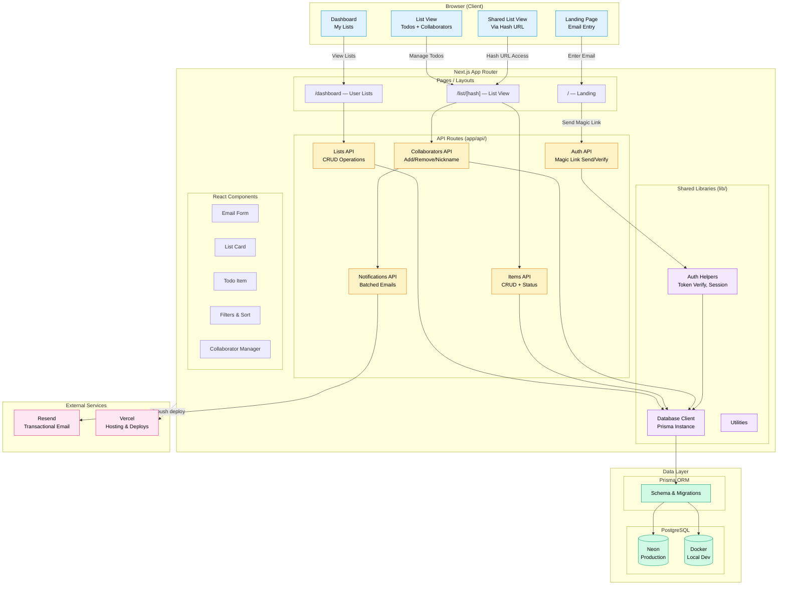
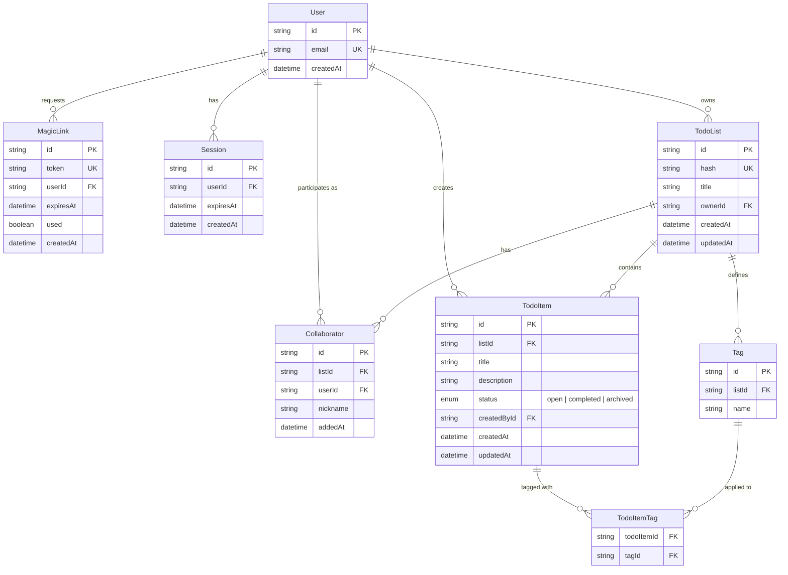
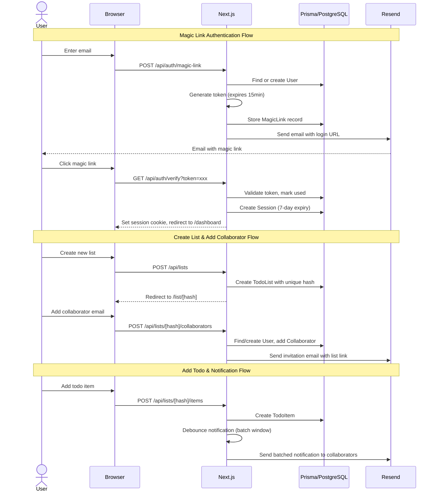

# KinkList — Architecture Diagram

```mermaid
graph TB
    subgraph Client["Browser (Client)"]
        LP[Landing Page<br/>Email Entry]
        DB[Dashboard<br/>My Lists]
        LV[List View<br/>Todos + Collaborators]
        SV[Shared List View<br/>Via Hash URL]
    end

    subgraph NextJS["Next.js App Router"]
        subgraph Pages["Pages / Layouts"]
            P1["/ — Landing"]
            P2["/dashboard — User Lists"]
            P3["/list/[hash] — List View"]
        end

        subgraph API["API Routes (app/api/)"]
            A1[Auth API<br/>Magic Link Send/Verify]
            A2[Lists API<br/>CRUD Operations]
            A3[Items API<br/>CRUD + Status]
            A4[Collaborators API<br/>Add/Remove/Nickname]
            A5[Notifications API<br/>Batched Emails]
        end

        subgraph Lib["Shared Libraries (lib/)"]
            AUTH[Auth Helpers<br/>Token Verify, Session]
            DBC[Database Client<br/>Prisma Instance]
            UTILS[Utilities]
        end

        subgraph Components["React Components"]
            C1[Email Form]
            C2[List Card]
            C3[Todo Item]
            C4[Filters & Sort]
            C5[Collaborator Manager]
        end
    end

    subgraph Data["Data Layer"]
        subgraph Prisma["Prisma ORM"]
            SCHEMA[Schema & Migrations]
        end

        subgraph DB_Engine["PostgreSQL"]
            NEON[(Neon<br/>Production)]
            DOCKER[(Docker<br/>Local Dev)]
        end
    end

    subgraph External["External Services"]
        RESEND[Resend<br/>Transactional Email]
        VERCEL[Vercel<br/>Hosting & Deploys]
    end

    %% Client navigation
    LP -->|Enter Email| P1
    DB -->|View Lists| P2
    LV -->|Manage Todos| P3
    SV -->|Hash URL Access| P3

    %% Page to API calls
    P1 -->|Send Magic Link| A1
    P2 --> A2
    P3 --> A3
    P3 --> A4

    %% API dependencies
    A1 --> AUTH
    A2 --> DBC
    A3 --> DBC
    A4 --> DBC
    A4 --> A5
    A5 --> RESEND

    %% Auth flow
    AUTH --> DBC

    %% Data access
    DBC --> SCHEMA
    SCHEMA --> NEON
    SCHEMA --> DOCKER

    %% Deployment
    NextJS -.->|git push deploy| VERCEL

    %% Styling
    classDef client fill:#e0f2fe,stroke:#0284c7,color:#000
    classDef api fill:#fef3c7,stroke:#d97706,color:#000
    classDef data fill:#d1fae5,stroke:#059669,color:#000
    classDef external fill:#fce7f3,stroke:#db2777,color:#000
    classDef lib fill:#f3e8ff,stroke:#9333ea,color:#000

    class LP,DB,LV,SV client
    class A1,A2,A3,A4,A5 api
    class NEON,DOCKER,SCHEMA data
    class RESEND,VERCEL external
    class AUTH,DBC,UTILS lib
```

```mermaid
erDiagram
    User {
        string id PK
        string email UK
        datetime createdAt
    }

    MagicLink {
        string id PK
        string token UK
        string userId FK
        datetime expiresAt
        boolean used
        datetime createdAt
    }

    Session {
        string id PK
        string userId FK
        datetime expiresAt
        datetime createdAt
    }

    TodoList {
        string id PK
        string hash UK
        string title
        string ownerId FK
        datetime createdAt
        datetime updatedAt
    }

    Collaborator {
        string id PK
        string listId FK
        string userId FK
        string nickname
        datetime addedAt
    }

    TodoItem {
        string id PK
        string listId FK
        string title
        string description
        enum status "open | completed | archived"
        string createdById FK
        datetime createdAt
        datetime updatedAt
    }

    Tag {
        string id PK
        string listId FK
        string name
    }

    TodoItemTag {
        string todoItemId FK
        string tagId FK
    }

    User ||--o{ MagicLink : "requests"
    User ||--o{ Session : "has"
    User ||--o{ TodoList : "owns"
    User ||--o{ Collaborator : "participates as"
    User ||--o{ TodoItem : "creates"
    TodoList ||--o{ Collaborator : "has"
    TodoList ||--o{ TodoItem : "contains"
    TodoList ||--o{ Tag : "defines"
    TodoItem ||--o{ TodoItemTag : "tagged with"
    Tag ||--o{ TodoItemTag : "applied to"
```

```mermaid
sequenceDiagram
    actor U as User
    participant B as Browser
    participant N as Next.js
    participant P as Prisma/PostgreSQL
    participant R as Resend

    Note over U,R: Magic Link Authentication Flow
    U->>B: Enter email
    B->>N: POST /api/auth/magic-link
    N->>P: Find or create User
    N->>N: Generate token (expires 15min)
    N->>P: Store MagicLink record
    N->>R: Send email with login URL
    R-->>U: Email with magic link
    U->>B: Click magic link
    B->>N: GET /api/auth/verify?token=xxx
    N->>P: Validate token, mark used
    N->>P: Create Session (7-day expiry)
    N-->>B: Set session cookie, redirect to /dashboard

    Note over U,R: Create List & Add Collaborator Flow
    U->>B: Create new list
    B->>N: POST /api/lists
    N->>P: Create TodoList with unique hash
    N-->>B: Redirect to /list/[hash]
    U->>B: Add collaborator email
    B->>N: POST /api/lists/[hash]/collaborators
    N->>P: Find/create User, add Collaborator
    N->>R: Send invitation email with list link

    Note over U,R: Add Todo & Notification Flow
    U->>B: Add todo item
    B->>N: POST /api/lists/[hash]/items
    N->>P: Create TodoItem
    N->>N: Debounce notification (batch window)
    N->>R: Send batched notification to collaborators
```
